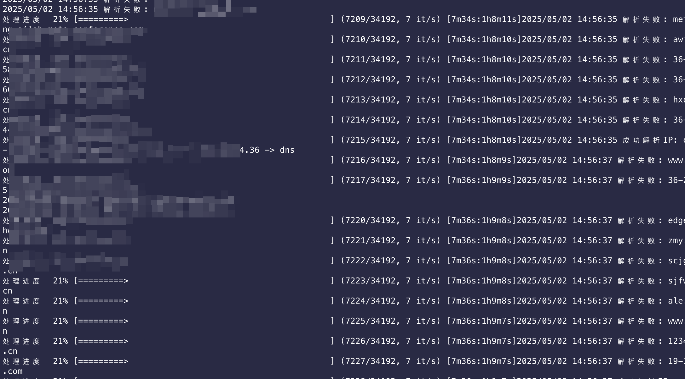

# domain2ip
资产收集环节中的一块积木，过滤CDN，域名=>有效IP

### 详细代码流:
- https://deepwiki.com/sv3nbeast/domain2ip
### 大概原理:
1. 通过8.8.8.8 dns服务器A记录解析IP数量判断是否存在CDN，大概类似于多地ping域名，存在CDN域名会获得多个解析IP的基本逻辑
2. 解析IP获取是通过223.5.5.5 dns服务器获取，因为8.8.8.8会有缓存误报

之前也用过检测CNAME办法判断CDN，正常域名可以检测到，只会误报，但不会漏报，但是收集的子域名中还会存在使用cdn域名对应cname的域名，这样就导致这些域名没有cname解析，但解析的IP还是cdn厂商的，导致端口扫描或测绘平台收集资产的环节存在问题

